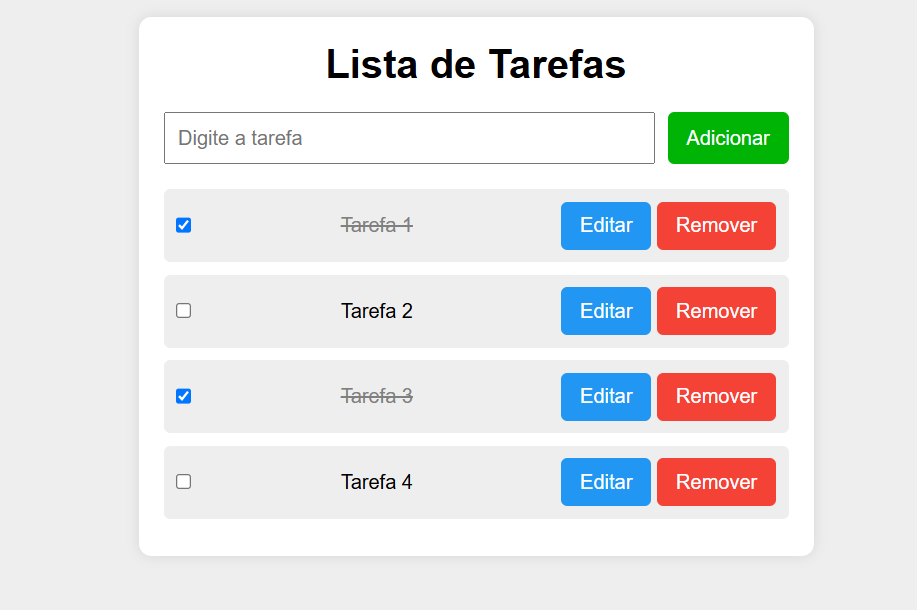

<h1 align="center">Avaliação de Front-End</h1>

## Prova prática

### Caso: Aplicativo de lista de tarefas interativa

Desenvolver um sistema de lista de tarefas.

### Funcionalidades:
- Adicionar Tarefa: campo para digitar a descrição da tarefa e botão para adicionar à lista;
- Listar tarefas: as tarefas são exibidas na página;
- Remover tarefa: botão para excluir a tarefa que selecionar;
- Editar tarefa: botão para editar o texto da tarefa;
- Marcar tarefa como concluida: ao clicar no checkbox a tarefa mudara de aparência.

### Demonstrativo da página

### Linguagens de programação utilizadas

``HTML5``  
``CSS3``  
``Java Script``

# Aluno

[ Guilherme Henrique Silva](https://github.com/Guilherme-Henr-Silva)